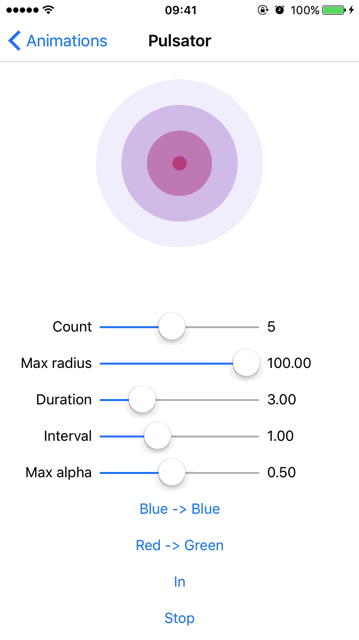
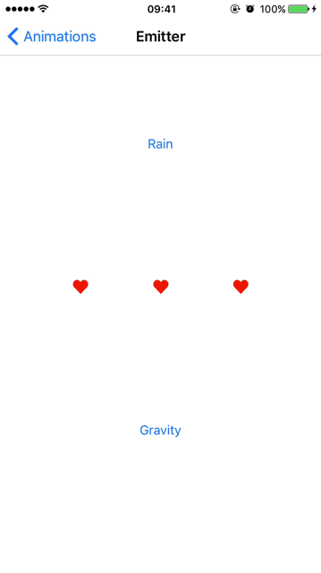
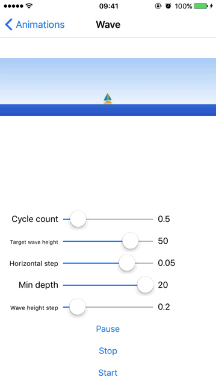

# CoreAnimationDemo

iOS core animation demo.

## Pulsator

Implimented with CAReplicatorLayer and CABasicAnimation.

Blog: http://www.cnblogs.com/silence-cnblogs/p/6951948.html

## Emitter

Implemented with CAEmitterLayer.

Blog: http://www.cnblogs.com/silence-cnblogs/p/6971533.html

## Wave

Implemented with CAShapeLayer, CAGradientLayer and CADisplayLink.

Blog: http://www.cnblogs.com/silence-cnblogs/p/6979418.html